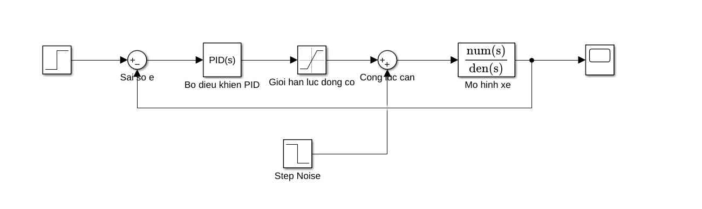
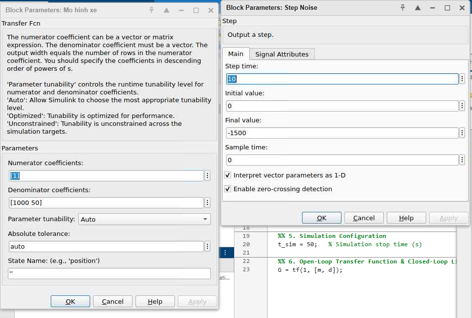
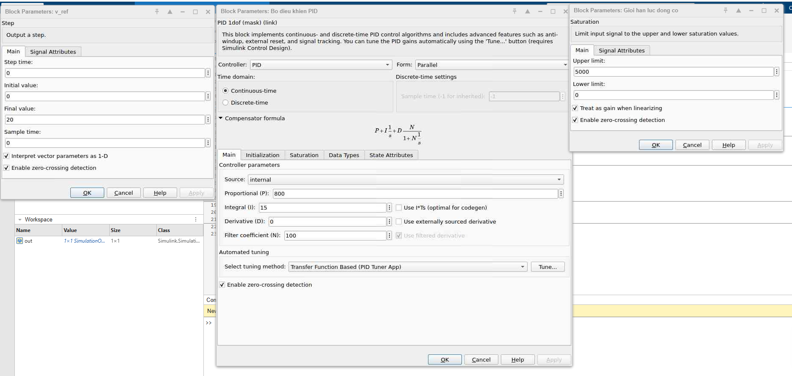
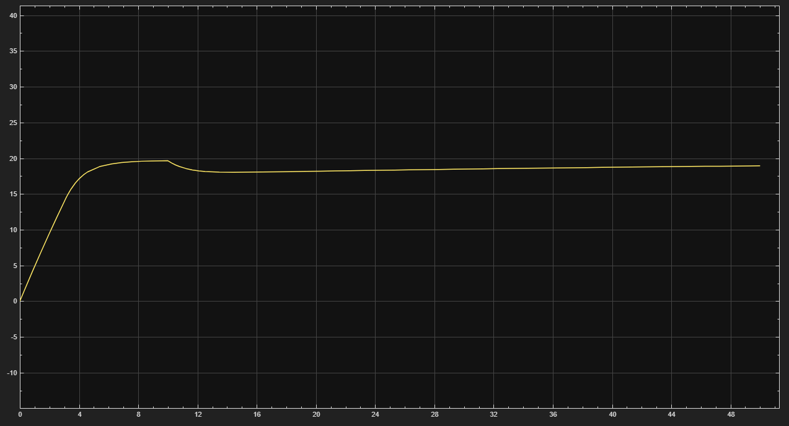

# Vehicle Speed Control System (Cruise Control) — PID Design & Simulink Simulation

Course project: *Linear Control Theory*, HUST — 2025.2, team of 5.

This repository covers the simulation and evaluation of a closed-loop **Vehicle Speed Control (Cruise Control)** system using MATLAB and Simulink, including resistance noise and engine saturation handling.

## 1. Technical Specifications

| Parameter | Symbol | Value | Unit | Description |
| :--- | :---: | :---: | :---: | :--- |
| **Vehicle Mass** | `m` | 1000 | kg | Total mass of the vehicle |
| **Damping Coefficient** | `d` | 50 | N.s/m | Aerodynamic drag and road friction |
| **Target Speed** | `v_ref` | 20 | m/s | Setpoint for the cruise control (~72 km/h) |
| **Max Engine Force** | `F_max` | 5000 | N | Maximum driving force (Actuator saturation) |
| **Min Engine Force** | `F_min` | 0 | N | Minimum force (No braking force applied in this scenario) |
| **Load Disturbance** | `F_noise` | -1500 | N | Sudden external resistance (e.g., uphill slope) applied at t = 10s |

## 2. Mathematical Model & Controller

### Vehicle Dynamics (Plant)
The longitudinal vehicle dynamics is modeled as a first-order transfer function according to Newton's Second Law ($m\dot{v} + dv = u$):
 
`G(s) = 1 / (m*s + d) = 1 / (1000s + 50)`

### PID Controller
The controller is tuned to maintain the setpoint while handling physical constraints and disturbances:
- **Proportional (Kp):** `800`
- **Integral (Ki):** `15`
- **Derivative (Kd):** `0`

## 3. Simulink Model

The simulation is built in Simulink, incorporating actuator saturation (Engine Limits) and external load disturbance (Step Noise) for realistic behavior.

## 4. Technical specifications

 

## 5. Simulation Results & Performance Metrics

### Vehicle Speed Response
The graph below shows the closed-loop step response of the vehicle speed, including the recovery phase after the load disturbance at t = 10s.

### Performance Evaluation

| Performance Metric | Design Target | Simulation Value |
|---|---|---|
| Target Speed ($v_{ref}$) | 20 m/s | 20 m/s |
| Settling Time ($T_s, 5\%$) | < 10 s | ~ 6.5 s |
| Peak Overshoot ($\sigma\%$) | < 5% | ~ 0% |
| Steady-State Error ($e_{st}$) | 0 | 0 |
| Recovery Time (post-disturbance) | < 10 s | ~ 8 s |

